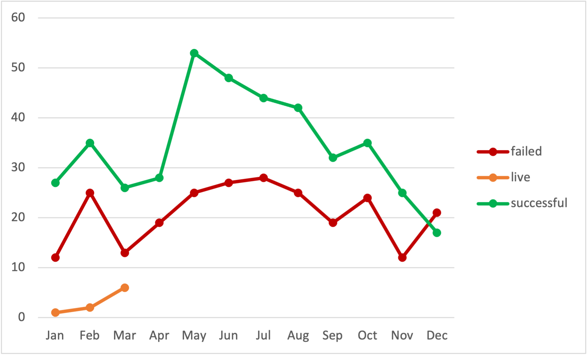

# Kickstarter-analysis
Performing Analysis on Kickstarter data to discover trends
## An Analysis of Kickstarter Campaigns
### Context
* Theater is the most sucesfull crowdfunind category across the countries and also in the US followed by Music

* Within the theaters crowdfounding plays are not only the most important, but also the ones that have most success, but in the other hand also te most failed

---
### Incentive Set Up
* Average pledge for all crowdfunding across countries and categories is $88 dls
* In US is 87dls
* For theaters in US is $86dls
* For Plays is 81
---
### When and for how long to have the crowdfunding
* In us most succesfull crowdfundind for plays un US occurs on May-Jun

* In average succesfull crowdfunding campaigns have a duration of 29 days
---
### References and Other Markets
* Inspiration Play Foresight had a Objetive of 2k dls, achieved 100% founding with an over the average donation per baker of $117 dls and a duration of 24 days.
